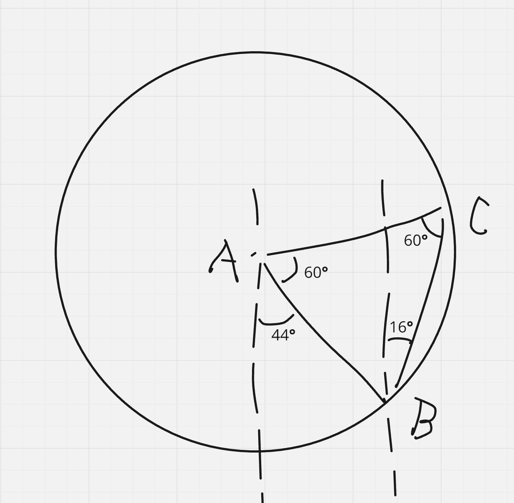
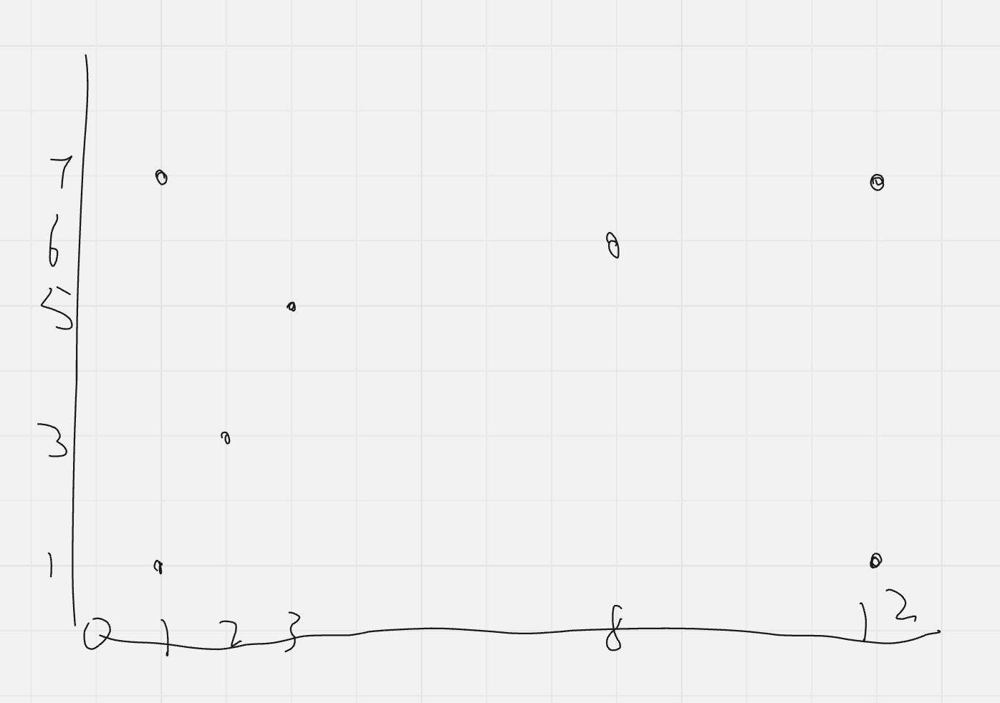

# 方向点

求得每个点的上下左右点。

## 伪代码

```
以 x 轴排序所有点
以 y 轴排序所有点
遍历所有点，当前点为 p {

     获取 p 上方的所有点
     找到距离 p 最近的点 minUpP
     若有多个 minUpP，则取离 y 轴最近的点

     获取 p 下方的所有点
     找到距离 p 最近的点 minDownP
     若有多个 minDownP，则取离 y 轴最近的点

     获取 p 左方的所有点
     找到距离 p 最近的点 minLeftP
     若有多个 minLeftP，则取离 x 轴最近的点

     获取 p 右方的所有点
     找到距离 p 最近的点 minRP
     若有多个 minRP，则取离 x 轴最近的点
}
```

当同一方向，原点距离两点一样时，如何确定某个点是原点的方向？如果是 y 轴方向，则选择距离 y 轴更近的点：例如一个 y 轴对称的三角形，原点距离两点相等，将三角形偏移一度，便知原点的方向点应是离 y 轴更近的点。

为什么两个点之间不一定是相互方向的？例如 A 指向 B，则 B 一定指向 A，这是不成立的。下面的图片展示了 A 下面是 B，而 B 的上面是 C：



## 实验

```
            6
       5
  4
 3
2           1
```

网格化为

```
4 5 6
3 1 1
2 1 1
```

---

```
[8, 6], [12, 1], [12, 7], [1, 1], [2, 3], [3, 5], [1, 7]
```

```
7           6
       5
  4
 3
2           1
```



网格化为

```
7 5 6
4 5 6
3 1 1
2 1 1
```

---

```
            6   7
       5
  4
 3
2           1
```

网格化为

```
4 5 6 7
3 1 1 1
2 1 1 1
```

---

```
       7
            6
       5
  4
 3
2           1
```

网格化为

```
7 7 6
4 5 6
3 1 1
2 1 1
```

---

```
             6
        5
   4
7 3
 2           1
```

网格化为

```
7 4 5 6
7 3 1 1
2 2 1 1
```